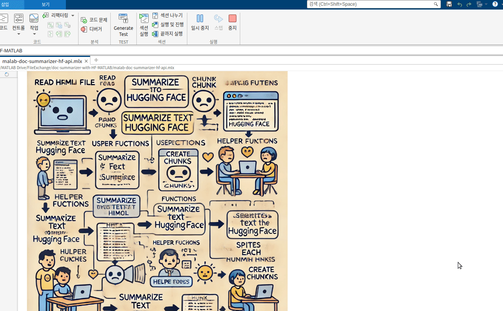

---

# LLM-based Document Summarizer: Leveraging Hugging Face API for Efficient Text Processing

This LLM-based Document Summarizer application demonstrates how to download, process, and summarize long documents using the Hugging Face API. It is designed to handle large documents by splitting them into manageable chunks and summarizing each chunk individually. The final result is a cohesive summary of the entire document.


## Features
- Downloads and processes HTML content from a given URL (e.g., Project Gutenberg or arXiv).
- Extracts plain text from HTML format for text summarization.
- Splits long documents into smaller chunks for efficient processing by the Hugging Face API.
- Summarizes each chunk using the Hugging Face API (e.g., using the `google/pegasus-xsum` model).
- Combines all the summarized chunks into a final, cohesive summary.

## Prerequisites
- MATLAB (version 2021 or later is recommended).
- Hugging Face API key (for using Hugging Face models).
- A text file containing your Hugging Face API key (`API_KEY.txt`).

## Setup Instructions

### 1. Obtain a Hugging Face API Key
- Visit [Hugging Face API Token page](https://huggingface.co/settings/tokens) and generate your API key.
- Save your API key in a text file named `API_KEY.txt` in the same directory as the MATLAB script.

### 2. Set Up Your MATLAB Script
1. Clone or download the repository.
2. Open MATLAB and navigate to the folder containing the script.
3. Ensure that the `API_KEY.txt` file is in the same directory as the script.
4. Set the URL of the document you want to summarize.

### 3. Modify User Settings
In the script, define your Hugging Face API key and set the maximum chunk size for text processing.

```matlab
% Set the document URL (replace with your desired document)
url = "https://www.gutenberg.org/files/11/11-h/11-h.htm";

% Set the maximum chunk size (number of characters per chunk)
chunkSize = 3000;  % Adjust as needed

% Load your Hugging Face API key
fileID = fopen('API_KEY.txt', 'r');
apiKey = strtrim(fgets(fileID));
fclose(fileID);

disp(['API Key successfully loaded: ', apiKey]);  % For debugging purposes
```

### 4. Running the Application
Once you have set up the script and defined the document URL and chunk size, run the MATLAB script. The application will:
- Download the document from the URL.
- Extract plain text from the HTML content.
- Split the document into manageable chunks.
- Summarize each chunk using the Hugging Face API.
- Combine the individual summaries into a final cohesive summary.

### 5. Customizing the Model
The default model used for summarization is [google/pegasus-xsum](https://huggingface.co/google/pegasus-xsum), but you can modify the `summarizeTextHuggingFace` function to use a different Hugging Face model if needed. Please, refer to the [models](models) folder for more details.

```matlab
url = "https://api-inference.huggingface.co/models/google/pegasus-xsum";  % Default model URL
```

You can replace `google/pegasus-xsum` with another available model of your choice.

### 6. Handling Rate Limits
To avoid triggering rate limits (e.g., 503 errors) when making requests to the Hugging Face API, the script pauses for 5 seconds between each request. You can adjust this pause time by modifying the `pauseBetweenRequests` variable.

```matlab
pauseBetweenRequests = 5;  % Adjust the wait time between requests as needed
```

## Functions

### `summarizeTextHuggingFace(apiKey, text)`
This function uses the Hugging Face API to summarize the input text. It sends the text to the specified Hugging Face model and returns the summary.

### `createChunks(text, chunkSize)`
This function splits the long text into smaller chunks, each with a specified maximum character count. It tokenizes the input text into sentences and groups them into manageable chunks.

## Example Use Case
1. Download and extract the text of a long document (e.g., a research paper or book) from a URL.
2. Split the document into chunks of manageable size.
3. Summarize each chunk using the Hugging Face API.
4. Combine the summaries to generate a final, concise summary of the entire document.

## Example Output
After running the script, the final summary will be displayed in the MATLAB command window.

```matlab
    {'Alice was beginning to get very tired of sitting by her sister’s bank, and had n'}
    {'o pictures or conversations in it, or of Alice’s Adventures in Wonderland. Alice'}
    {' cried so hard that her eyes began to water . Alice looked at the Dodo with a pu'}
    {'zzled look on her face . Alice spread out her hand and made a snatch in the air '}
    {'. The Caterpillar put the hookah into its mouth and began smoking . The Duchess '}
    {'of Cambridge was nursing her baby boy in the kitchen , when the cook came into t'}
    {'he room , and asked the Duchess if she knew the time it took for the earth to tu'}
    {'rn round . Alice looked at the Hatter with a smile on her face. It was a fine da'}
    {'y , and Alice was walking by the rose-tree , when she saw Three and Two , and Tw'}
    {'o , and Two , and Two , and Two , and Two , and Two , and Two , and Two , and Tw'}
    {'o , Alice looked up at the Duchess of Cambridge , and asked what she would say t'}
    {'o her if she had the choice . The whiting , the whiting, the whiting, the whitin'}
    {'g, the whiting, the whiting, the whiting, the whiting, the whiting, the whiting,'}
    {' the whiting, the whiting, the whiting, the whiting, the whiting, the “ I’m a ha'}
    {'tter , your Majesty , ” said the Hatter . There was a big smile on the King’s fa'}
    {'ce as he saw the tarts on the table .'}
```

## Demo
You can view a demonstration of how the MATLAB Document Summarizer works by playing the following GIF:



This GIF shows the process of downloading, chunking, summarizing, and combining the final summary of a document using the Hugging Face API.


## Troubleshooting
- **"API_KEY.txt file not found" error**: Ensure that the `API_KEY.txt` file is in the same directory as the MATLAB script, and that it contains a valid [Hugging Face API key](https://huggingface.co/settings/tokens).
- **503 error or rate limit exceeded**: Increase the pause time between requests or check Hugging Face's rate limits.
- **Empty summary**: If a chunk cannot be summarized, the function will attempt to retry up to three times before returning an error message.

## License
This project is licensed under the MIT License - see the [LICENSE.md](LICENSE.md) file for details.

## Acknowledgments
- Hugging Face for providing powerful pre-trained models for text summarization.
- MATLAB for offering a versatile environment for text processing and API integration.

---

